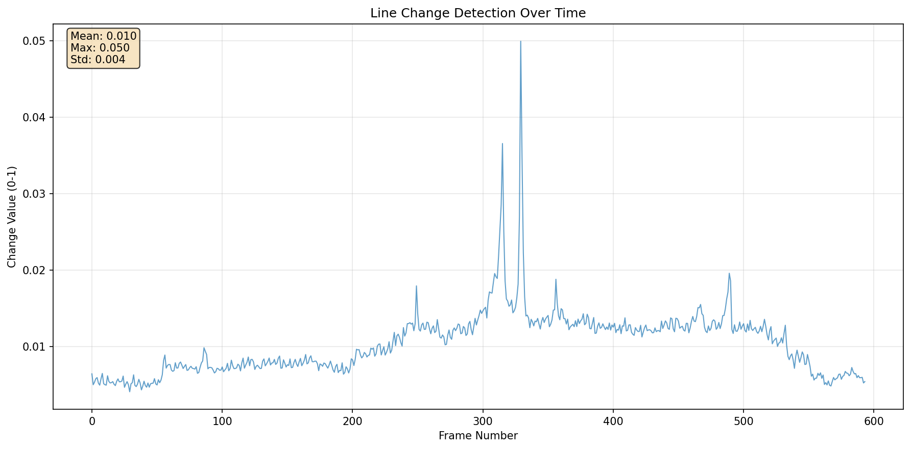

# Strip Photography / Slit Photography

A digital implementation of **strip photography** (also called **slit photography**) that captures a two-dimensional image as a sequence of one-dimensional images over time.


Strip photography records a moving scene over time by extracting the same line position from each video frame and assembling them into a composite image where:
- One axis represents **space** (the slit/line being observed)
- The other axis represents **time** (progression through video frames)
- Moving objects appear as visible shapes, stationary objects as stripes
- Object width is inversely proportional to speed (faster = narrower, slower = wider)

## Usage

**Row Mode** - Extract horizontal lines with threshold filtering:
```bash
uv run main.py .\line500fps32pix.mp4 --yrow 16 --output demo.jpg --threshold 0.005
```

**Debug Mode** - Analyze changes and generate threshold recommendations:
```bash
uv run main.py .\line500fps32pix.mp4 --yrow 16 --output demo.jpg --debug
```


## Setup
Install dependencies with uv:
```bash
uv sync
```

## Output Modes
- **Column mode**: Extracts vertical line (`--xcolumn`) → Width = frames, Height = video height
- **Row mode**: Extracts horizontal line (`--yrow`) → Width = video width, Height = frames

## Features

**Change Detection**: Automatically filters frames with minimal changes using configurable thresholds
- Use `--threshold` (0-1) to control sensitivity
- `--debug` mode provides threshold recommendations and change analysis
- Higher thresholds = more compression, fewer frames

**Threshold Guide**:
- `0.001-0.005`: High sensitivity (10-30% compression)
- `0.005-0.02`: Medium sensitivity (30-70% compression)
- `0.02+`: Low sensitivity (70%+ compression)
