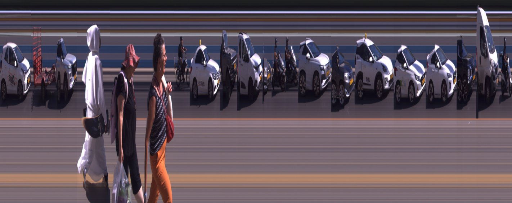
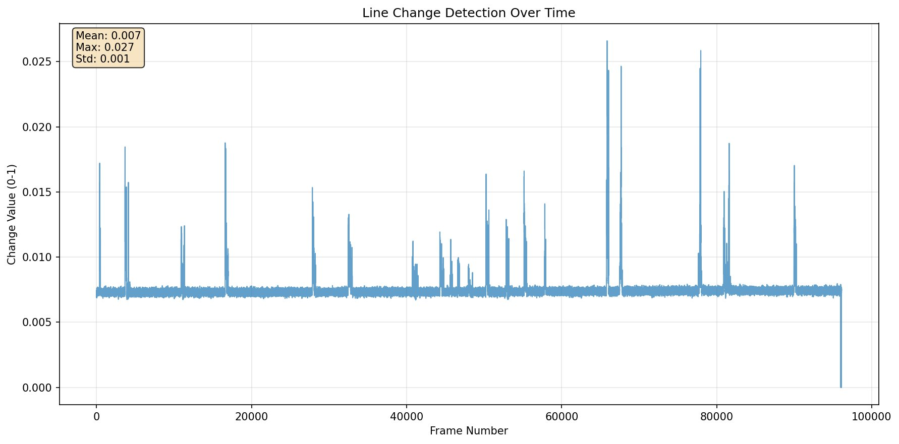

# Strip Photography / Slit Photography

A digital implementation of **strip photography** (also called **slit photography**) that captures a two-dimensional image as a sequence of one-dimensional images over time.



Strip photography records a moving scene over time by extracting the same line position from each video frame and assembling them into a composite image where:
- One axis represents **space** (the slit/line being observed)
- The other axis represents **time** (progression through video frames)
- Moving objects appear as visible shapes, stationary objects as stripes
- Object width is inversely proportional to speed (faster = narrower, slower = wider)

## Usage

**Basic Usage** - Uses smart defaults (yrow=8, auto output to results/):
```bash
uv run main.py .\line500fps32pix.mp4
```
Output: `results/line500fps32pix_a3f2_t0_01.jpg` (auto-generated with UUID and threshold)

**Row Mode** - Extract horizontal lines with custom settings:
```bash
uv run main.py .\line500fps32pix.mp4 --yrow 16 --threshold 0.005
```

**With Relax** - Include extra frames around threshold frames for smoother transitions:
```bash
uv run main.py .\line500fps32pix.mp4 --relax 5
# or use default relax value (100):
uv run main.py .\line500fps32pix.mp4 --relax
```

**Video Mode** - Generate MJPEG video showing accumulated scan lines over time:
```bash
uv run main.py .\line500fps32pix.mp4 --video --fps 30
```
Output: `results/video/line500fps32pix_a3f2_t0_01_fps30_0.avi`

**Video with Timestamp** - Add frame count overlay to video:
```bash
uv run main.py .\line500fps32pix.mp4 --video --fps 30 --timestamp
```

**Alpha Video Mode** - Generate PNG sequence with transparency for video editing:
```bash
uv run main.py .\line500fps32pix.mp4 --video --alpha --fps 30 --timestamp
```
Output: `results/video/line500fps32pix_a3f2_t0_01_fps30_0_alpha/` (directory with PNG sequence)

**Parallel Processing** - Use multiple CPU cores for faster processing:
```bash
# Enable parallel processing with 4 workers (default: auto-detect CPU cores)
uv run main.py .\line500fps32pix.mp4 --video --alpha --workers 4

# Disable parallel processing for debugging or compatibility
uv run main.py .\line500fps32pix.mp4 --video --alpha --no-parallel
```

**Debug Mode** - Analyze changes and generate threshold recommendations:
```bash
uv run main.py .\line500fps32pix.mp4 --debug
```
Output: `results/debug/line500fps32pix_7c91_t0_01_changes.png`


Debug mode generates PowerShell commands to test all suggested thresholds:
```powershell
0.0087,0.0098,0.0112,0.0121,0.0159 | %{uv run .\main.py video.mp4 --threshold $_}
```

## Setup
Install dependencies with uv:
```bash
uv sync
```

## Parameters

### Required
- `video_file` - Path to input video file

### Optional
- `--xcolumn N` - Extract vertical line at x-coordinate (column mode)
- `--yrow N` - Extract horizontal line at y-coordinate (row mode, **default: 8**)
- `--output PATH` - Output file path (default: auto-generated to `results/` with UUID)
- `--threshold N` - Change threshold 0-1 for frame inclusion (default: 0.01)
- `--relax [N]` - Include N extra frames before/after threshold frames (default: 0, or 100 if flag used without value)
- `--debug` - Analyze changes without creating strip image, outputs to `results/debug/`
- `--video` - Generate MJPEG video showing accumulated scan lines over time
- `--fps N` - Output video frame rate (default: 30.0, only used with `--video`)
- `--alpha` - Generate PNG sequence with alpha transparency for video editing (video mode only)
- `--timestamp` / `--ts` - Embed frame count on bottom left corner (video mode only)
- `--timeline` - Overlay frame numbers as timeline/ruler on output image (image mode only)
- `--start N` - Start frame number (0-based, default: 0)
- `--end N` - End frame number (0-based, default: last frame)

### Performance Options
- `--parallel` - Use parallel processing for better performance (default: True)
- `--no-parallel` - Disable parallel processing (use sequential processing)
- `--workers N` - Number of worker processes for parallel processing (default: auto-detect CPU cores)

### Output Modes
- **Image mode** (default): Creates static strip photography image
  - **Column mode**: Extracts vertical line (`--xcolumn`) → Width = frames, Height = video height
  - **Row mode**: Extracts horizontal line (`--yrow`, **default**) → Rotated 90° CW for proper orientation
- **Video mode** (`--video`): Creates MJPEG video showing scan line accumulation over time
  - Each frame shows accumulated scan lines up to that point in time
  - Final frame shows complete strip photography image
  - Video dimensions automatically determined by input video and number of significant frames
- **Alpha video mode** (`--video --alpha`): Creates PNG sequence with alpha transparency
  - Perfect for video editing with transparent backgrounds instead of black padding
  - Each PNG frame shows progressive scan line accumulation with alpha channel
  - Import as PNG sequence in video editors at specified FPS
  - No keyframe compression - ideal for editing workflows

## Features

**Smart Defaults**:
- Defaults to row mode at y=8 if no mode specified
- Auto-generates output filename with UUID and threshold: `results/video_a3f2_t0_01.jpg`
- Automatically appends `.jpg` extension if none provided
- Row mode output is rotated 90° clockwise for proper viewing

**Change Detection**: Automatically filters frames with minimal changes using configurable thresholds
- Use `--threshold` (0-1) to control sensitivity
- `--debug` mode provides threshold recommendations and change analysis
- Higher thresholds = more compression, fewer frames

**Relax Feature**: Include extra frames around significant changes for smoother transitions
- `--relax 5` includes 5 frames before/after each threshold frame
- `--relax` without value defaults to 100 frames

**Threshold Guide**:
- `0.001-0.005`: High sensitivity (10-30% compression)
- `0.005-0.02`: Medium sensitivity (30-70% compression)
- `0.02+`: Low sensitivity (70%+ compression)

**Output Organization**:
- Image mode: `results/` folder
- Video mode: `results/video/` folder
- Debug mode: `results/debug/` folder

**Video Mode Features**:
- Creates MJPEG AVI files showing scan line accumulation over time
- Each video frame shows the progressive build-up of the strip photography effect
- Configurable frame rate with `--fps` parameter
- Optional timestamp overlay with `--timestamp` / `--ts` showing frame count in bottom left corner
- Video dimensions automatically calculated based on input video and scan line count
- Compatible with both row and column extraction modes
- Timeline overlay not supported in video mode (use image mode with `--timeline` instead)

**Alpha Video Mode Features**:
- Creates PNG sequence with BGRA (alpha channel) for video editing
- Transparent background instead of black padding - perfect for compositing
- No keyframe compression - each PNG is independent for smooth editing
- Progressive scan line accumulation with alpha transparency
- Import into video editors as PNG sequence at specified FPS
- Ideal for professional video editing workflows requiring transparency
- Compatible with all major video editors (Premiere, Final Cut, DaVinci Resolve, etc.)

**Parallel Processing Features**:
- **Automatic multi-core utilization**: Enabled by default for video alpha processing
- **Parallel frame reading**: Video frames processed in batches across multiple CPU cores
- **Parallel change calculation**: Frame-to-frame difference calculations distributed across workers
- **Parallel PNG generation**: Multiple PNG files written simultaneously using thread pools
- **Smart thresholds**: Automatically uses parallel processing for >100 frames, sequential for smaller jobs
- **Configurable workers**: Use `--workers N` to control CPU core usage (default: auto-detect)
- **Fallback support**: Use `--no-parallel` for debugging or compatibility with older systems
- **Performance gains**: 2-4x faster processing on multi-core systems for large video sequences
